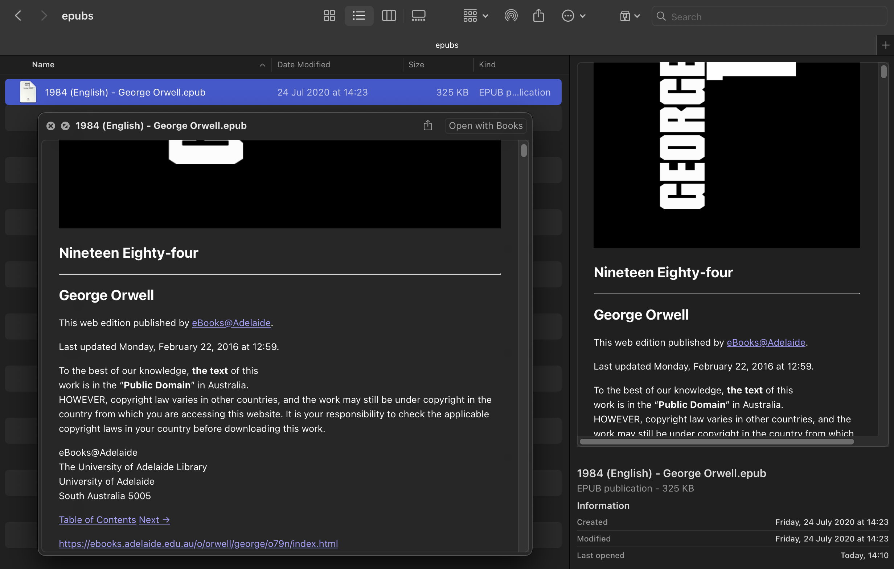

# EPUBQuickLookHost

A macOS Quick Look extension that previews `.epub` books right in Finder. Fully compatible and working with the latest version of MacOS (MacOS 15.5).



## Features
- View-based Quick Look using WKWebView
- Works with zipped `.epub` and bundle-style `com.apple.ibooks.epub`
- Dark Mode-friendly CSS

## Requirements
- macOS 12+

## Install
1. Download the latest **.dmg** from [Releases](../../releases).
2. Drag **EPUBQuickLookHost.app** to **/Applications** and open it once.
3. If needed: System Settings → Privacy & Security → Extensions → **Quick Look** → enable **EPUBQuickLook**.

## Usage
Select an `.epub` in Finder → press **Space**.

## Troubleshooting
- Run:
  ```bash
  pluginkit -m -p com.apple.quicklook.preview | grep -i EPUBQuickLook
  ```
  An entry called "EPUBQuickLook" should be visible with a "+" (enabled) symbol at the front of the line.
  
  If nothing is outputed, try force reloading:
  ```bash
  pluginkit -r
  killall Finder
  killall -u "$USER" QuickLookUIService 2>/dev/null || true
  ```
- Make sure you opened the host app once.
- If preview is blank: ensure network client entitlement is present, then rebuild.

# Build from Source
git clone https://github.com/arytek/epub-quicklook-extension.git
open EPUBQuickLookHost/EPUBQuickLookHost.xcodeproj
Run the host app once; build scheme "EPUBQuickLookHost." Then use "EPUBQuickLook" build scheme for further testing/development.

# Credits
[Aryan Nateghnia (Arytek)](https://github.com/arytek)

[ZIPFoundation](https://github.com/weichsel/ZIPFoundation)

# License
MIT

**CHANGELOG.md** (keep SemVer)
```markdown
# Changelog

## 1.0.0 — 2025-08-28
- First public release: Quick Look previews for EPUBs
